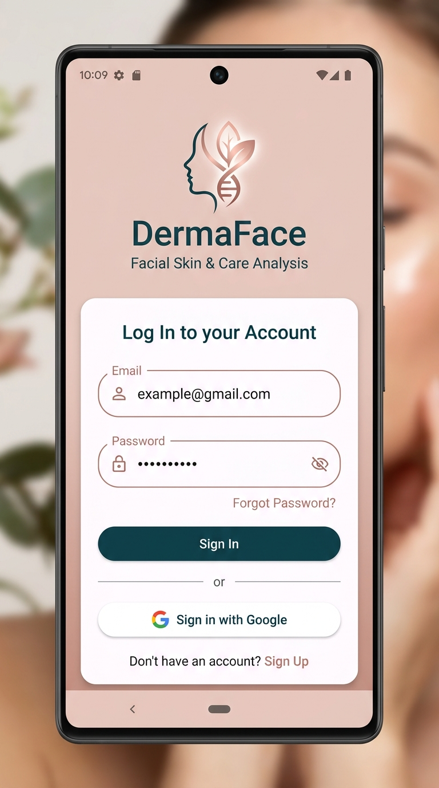
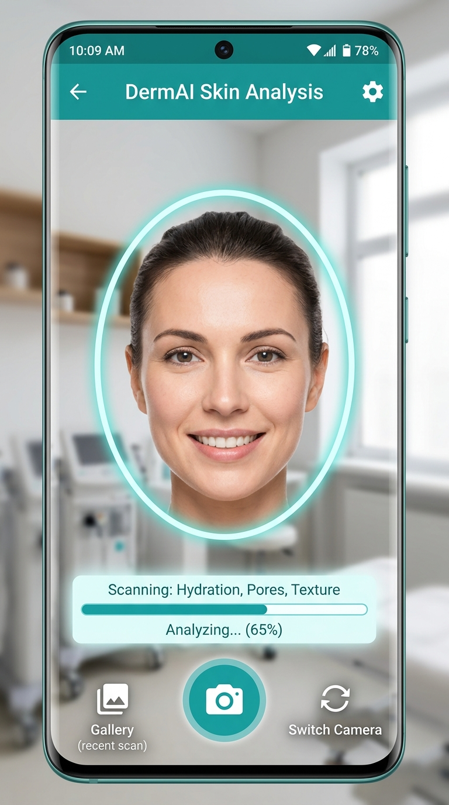
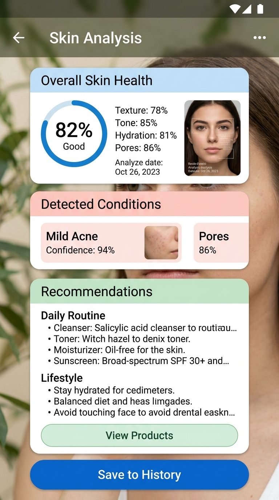

# ✨ DermaFace: Facial Skin Condition Detection & Care App

<p align="center">
  
  
  
</p>

**DermaFace** adalah aplikasi Android berbasis **Machine Learning (ML)** dan **Android Jetpack / Kotlin** yang didedikasikan untuk mendeteksi berbagai jenis penyakit dan masalah kulit wajah (seperti Jerawat/Acne, Flek Hitam/Hyperpigmentation, Eczema, Pori-pori Besar, dll). 

Aplikasi ini dikembangkan sebagai **Proyek Akhir Capstone Bangkit Academy** untuk membantu pengguna menganalisis kesehatan kulit wajah secara mandiri serta mendapatkan rekomendasi perawatan kulit (*skincare routine*) yang aman dan personal.

---

## 📸 Tampilan Aplikasi (Screenshots)

<table>
  <tr>
    <td width="33%" align="center">
      <strong>Splash & Autentikasi Google</strong><br/><br/>
      
    </td>
    <td width="33%" align="center">
      <strong>Live Facial Camera Scan</strong><br/><br/>
      
    </td>
    <td width="33%" align="center">
      <strong>Hasil Analisis & Rekomendasi</strong><br/><br/>
      
    </td>
  </tr>
</table>

---

## 🌟 Fitur Utama

- 🧬 **Deteksi Penyakit & Masalah Kulit Wajah (TensorFlow Lite & Firebase ML)**
  - Menganalisis kondisi kulit wajah secara presisi dengan tingkat akurasi dan *confidence score* tinggi.
- 💡 **Rekomendasi Skincare Personal**
  - Memberikan tips perawatan kulit harian (*Daily Routine*) serta kandungan produk yang disarankan.
- 🔐 **Autentikasi Aman dengan Firebase & Google Sign-In**
  - Kemudahan masuk bagi pengguna dengan integrasi Google Auth.
- 📜 **Riwayat Analisis (History & Cloud Firestore)**
  - Menyimpan riwayat deteksi kulit wajah pengguna ke Cloud Firestore agar dapat dipantau dari waktu ke waktu.
- 📰 **Artikel Kesehatan Kulit**
  - Menyajikan panduan dan artikel seputar kesehatan wajah dari Firebase Realtime Database.

---

## 🛠️ Spesifikasi Arsitektur & Teknologi

- **Bahasa Pemrograman**: Kotlin 1.8+
- **Pola Arsitektur**: MVVM (Model-View-ViewModel) & Repository Pattern
- **State Management & Async**: Kotlin Coroutines, Flow, LiveData, ViewModel
- **Machine Learning Engine**: TensorFlow Lite Quantized Model (`Face_Detection`) & Firebase ML
- **Backend & Cloud**: 
  - Firebase Authentication (Google Sign-In)
  - Cloud Firestore (Penyimpanan Riwayat Deteksi)
  - Firebase Realtime Database (Artikel Kesehatan)
- **Networking**: Retrofit 2, OkHttp3 Logging Interceptor, Gson
- **UI Components**: Material 3 Design, ViewBinding, CameraX API (`camera-camera2`, `camera-lifecycle`, `camera-view`), Glide (Image Loading)

---

## 📁 Struktur Direktori Proyek

```
SkinFace_Detection/
├── app/
│   ├── src/main/
│   │   ├── java/com/dicoding/capstone/dermaface/
│   │   │   ├── adapter/        # RecyclerView Adapters (Article, History)
│   │   │   ├── data/           # Remote & Local Data Sources, API Services
│   │   │   ├── repository/     # Repository Implementations
│   │   │   ├── ui/             # Activity & Fragment Views (Login, Scan, Result, History)
│   │   │   ├── utils/          # Image Converter, File Utility, Constants
│   │   │   └── viewmodel/      # ViewModels (Main, Auth, Scan, Article)
│   │   ├── res/                # XML Layouts, Material 3 Drawables & Color Themes
│   │   └── AndroidManifest.xml
│   └── build.gradle.kts
├── screenshots/                # Tangkapan layar dokumentasi UI
├── build.gradle.kts            # Build script root
├── settings.gradle.kts
└── README.md
```

---

## 🚀 Cara Kompilasi & Pengujian

### Prasyarat
- Android Studio Iguana / Jellyfish (atau versi lebih baru)
- JDK 17 atau JDK 21
- Berkas `google-services.json` di direktori `app/`

### Langkah-Langkah

1. **Clone repositori ini:**
   ```bash
   git clone https://github.com/rijallmmuk/SkinFace_Detection.git
   cd SkinFace_Detection
   ```

2. **Jalankan Build Gradle:**
   ```bash
   ./gradlew assembleDebug
   ```

3. **Jalankan pada Perangkat Android / Emulator:**
   - Hubungkan HP Android atau aktifkan Emulator.
   - Klik **Run 'app'** pada Android Studio.

---

## 👥 Tim Pengembang (Bangkit Capstone Team)

### 🤖 Machine Learning (ML)
- **M281D4KY1503** – Wahyu Ardiantito S. *(Universitas Negeri Medan)*
- **M734D4KX1910** – Juliani Jakin *(Institut Sains dan Teknologi Nasional)*
- **M281D4KX3359** – Rabiahtul Adawiah Hasyani *(Universitas Negeri Medan)*

### 📱 Mobile Development (MD)
- **A282D4KY3619** – **Mukhtarijal** *(Universitas Negeri Padang)*
- **A282D4KX3580** – Hayatun Nupus *(Universitas Negeri Padang)*

---
<p align="center">Dibuat dengan ❤️ untuk proyek Bangkit Academy Capstone.</p>
